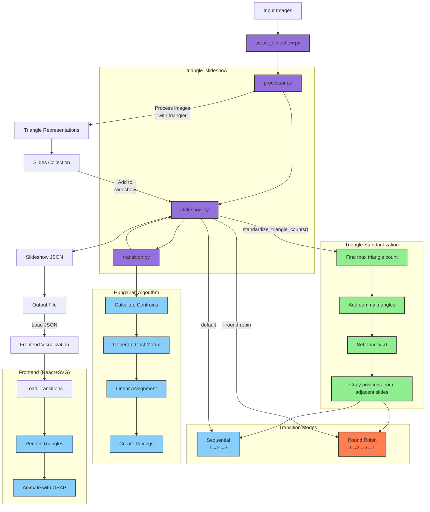

# Triangle Slideshow Workflow Diagram

This diagram illustrates the complete workflow of the triangle slideshow system, showing how images are processed, transformed into triangle representations, and transitions are created between them.

## Key Components

1. **Entry Point**: `create_slideshow.py` as the main CLI interface
2. **Core Package Structure**: The modular `triangle_slideshow` package with its three main components
3. **Processing Flow**: From input images to triangle representations to slides
4. **Triangle Standardization**: Ensures all slides have the same number of triangles:
   - Identifies the maximum triangle count across all slides
   - Adds invisible dummy triangles (opacity=0) to slides with fewer triangles
   - Copies position coordinates from adjacent slides for dummy triangles
   - Enables proper pairing between slides with originally different triangle counts
5. **Transition Options**: Two simple modes available:
   - **Sequential (default)**: Creates transitions between consecutive slides (1→2→3)
   - **Round-Robin**: Creates a circular pattern including transition from last to first (1→2→3→1)
6. **Hungarian Algorithm**: The key steps in matching triangles between slides
7. **Output Generation**: Creating the slideshow JSON file
8. **Frontend Integration**: Optional visualization with React and SVG

The standardization feature ensures consistent triangle counts across all slides, facilitating smooth transitions regardless of the original number of triangles in each slide. The round-robin transition feature creates circular transitions that loop back from the last slide to the first. 